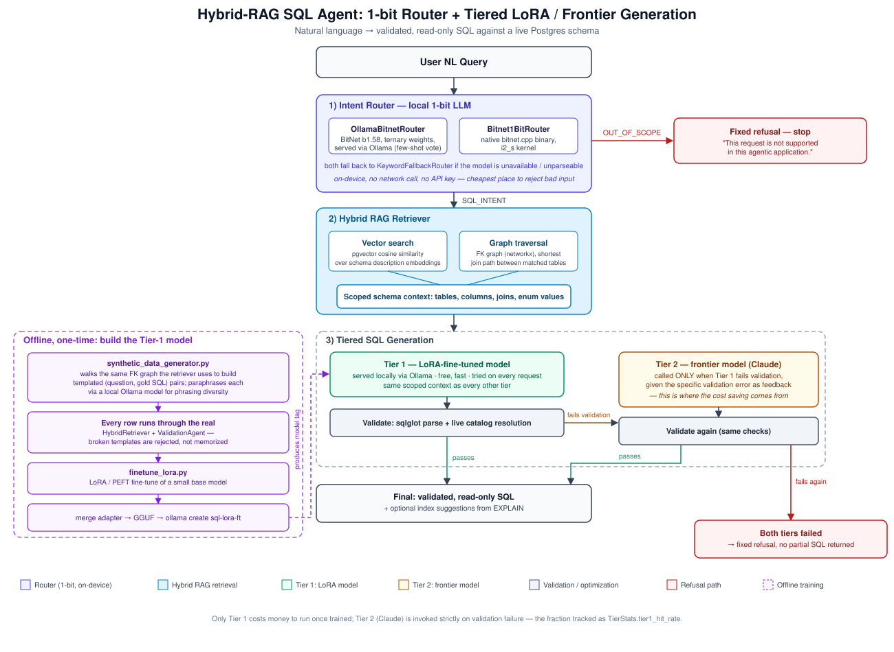

# A Text-to-SQL Agent That Refuses on Purpose: 1-bit Routing, Hybrid RAG, and a LoRA Model That Fires Claude Less Often

*How a brokerage NL→SQL system stays fast, cheap, and honest by putting a ternary-weight model at the front door and a fine-tuned local model in the hot path.*

---

Most "ask your database a question" demos share the same failure mode: they hand a frontier model the whole schema and hope. That works until the schema has 25 tables, half the columns are abbreviated to the point of uselessness (`qty_rem`, `avg_px`), and someone asks something the model has no business answering — "delete all my trades," or "write me a poem," or a prompt-injection attempt buried in a "query." At that point you're paying frontier-model prices to generate SQL against tables the model was never supposed to see, for requests it should have refused outright.

The system described here — built for a brokerage schema (accounts, orders, trades, positions, margin, corporate actions) — takes a different shape: a **cheap, local, 1-bit model decides whether to engage at all**; a **hybrid retriever** (vector search + graph traversal) hands the generation model only the slice of schema it actually needs; and **SQL generation itself is tiered**, so a small fine-tuned model absorbs the routine queries and a frontier model is called only when that model's output fails validation. Every SQL statement — from either tier — is parsed and checked against the live catalog before it's allowed to reach the user.

Here's the full picture, then the reasoning behind each piece.



## The gatekeeper: a ternary-weight model that costs nothing to run

Before any retrieval happens, before any LLM sees a single table name, the request passes through an intent router — and it's deliberately not a frontier model doing the deciding. It's a **BitNet b1.58** checkpoint: ternary weights ({-1, 0, 1}), served locally, answering one question — is this a data-retrieval ask about the brokerage domain, or not?

Three things make this worth doing instead of just letting the generation model sort it out:

- **Latency and cost stack on every request.** A 1-bit model classifying "is this in scope" takes milliseconds and costs nothing per call. Doing that filtering with a frontier model means paying frontier prices for every off-topic message, every "tell me a joke," every prompt-injection probe.
- **It can run air-gapped.** Brokerage compliance environments frequently require on-prem inference for anything touching account data. A router that never makes a network call satisfies that by construction — no API key, no egress.
- **It's the cheapest place in the whole pipeline to say no.** Out-of-scope classification happens *before* retrieval, so a malicious "query" that's actually a prompt-injection attempt never reaches the schema-aware generation model at all, unless it first fools the router into thinking it's a legitimate SQL ask.

The interesting part was actually getting the b1.58 checkpoint running reliably. The official `bitnet.cpp` i2_s CPU kernels have known upstream bugs on Apple Silicon (wrong weight-group layout, plus an activation-handling issue) that produce garbage, unparseable output. Rather than accept that, the router class (`Bitnet1BitRouter`) probes the model once with a canary prompt on first failure — if the canary also comes back garbled, it marks itself broken and falls back cleanly to a keyword heuristic, rather than silently misclassifying every request afterward. The more robust path in practice is `OllamaBitnetRouter`: the *same* ternary-weight checkpoint (`larenspear/bitnet_b1_58-large-GGUF`), but served through Ollama's standard (correct) kernels instead of the broken native binary. Same weights, working inference. Because it's a base model rather than an instruction-tuned one, classification runs as few-shot completion — nine examples, three rotations of the example order, majority vote — which turns out to matter: a single-shot ask from a small base model is noisy enough that voting measurably stabilizes the verdict.

Either way, the interface (`IntentRouter`) is the same, and both implementations fall back to a plain keyword matcher if the model genuinely isn't available. The rest of the pipeline never knows which router answered.

## The middle: hybrid RAG, because vector search alone gets you half the picture

Once a request is classified `SQL_INTENT`, it hits the retriever — and this is the part that keeps the whole system honest, because it decides exactly what the generation model is allowed to see.

Two retrieval mechanisms, doing two different jobs:

- **Vector search** (pgvector, cosine similarity over embedded `COMMENT ON TABLE`/`COMMENT ON COLUMN` descriptions) solves the *vocabulary* problem. A user asking about "customers who breached their risk limit" is never going to type `risk_limits.is_breached`. Embedding the schema's own descriptions and matching against the embedded question is what closes that gap.
- **Graph traversal** (a `networkx` graph built from `pg_constraint` foreign keys, nodes = tables, edges = FK relationships) solves the *structural* problem. Once vector search says "this touches `risk_limits`, `positions`, and `customers`," you still need the actual join path — shortest-path traversal between the matched nodes gives you the exact `ON a.x = b.y` chain instead of a bag of table names the generation model has to guess how to connect.

The two results merge into a **scoped schema context** — only the matched tables, their real columns and types, enum value lists, and resolved join conditions. Never the full 25-table DDL. This is what makes the "the model literally cannot reference a table it wasn't shown" guarantee enforceable, rather than aspirational: the identifiers in the prompt come from the retriever, not from the user's raw text, so nothing gets string-concatenated into SQL from untrusted input.

## The hot path: two tiers of SQL generation, one paying customer

This is the part that made the biggest difference to running cost, and it's an addition on top of the baseline single-generator pipeline, not a replacement for it.

The baseline (`agent_orchestrator.py`) always calls one generation model — in the zero-API-key configuration, a local Ollama model (`llama3.2`), with a system prompt that constrains it to real identifiers, SELECT-only output, and CTEs/window functions where joins need aggregation. That's fine, but it treats every query the same regardless of how routine it is.

`tiered_sql_agent.py` splits generation into two tiers behind the exact same interface, so it's a drop-in replacement — nothing else in the orchestrator has to change:

- **Tier 1** is a small model, **LoRA-fine-tuned** specifically on this schema's query patterns, served locally via Ollama. It's tried on *every* request, gets the same scoped context as any other tier, and costs nothing per call once trained.
- **Tier 2** is a frontier model (Claude), called **only** when Tier 1's output fails validation — and when it is called, it's given the specific validation error as feedback, not just a blind retry.

The cost saving doesn't come from removing retrieval or validation — both tiers get identical scoped context and identical scrutiny. It comes from the fraction of queries structurally routine enough that the fine-tuned model gets them right on the first try, tracked directly as `TierStats.tier1_hit_rate`. On a smoke test against a handful of representative brokerage queries during development, Tier 1 cleared validation on the first attempt every time — Tier 2 was never touched:

```
[tier stats] {'tier1_ok': 1, 'tier1_failed': 0, 'tier2_calls': 0, 'tier1_hit_rate': 1.0}

WITH open_orders AS (
  SELECT o.order_id, o.account_id, o.side, o.status
  FROM orders o
  WHERE o.status NOT IN ('closed', 'expired')
)
SELECT *
FROM open_orders
WHERE open_orders.account_id = 1001
```

*(for "List all open orders for account 1001")*

### Training data you don't have to hand-write

The fine-tune's training set isn't hand-labeled — that doesn't scale past a couple dozen examples. `synthetic_data_generator.py` walks the *same* FK graph the retriever traverses at inference time, plus enum values and column types read straight from the live catalog, to generate templated `(question, gold SQL)` pairs across the categories the system needs to handle: simple lookups, joins, aggregations, enum filters, subqueries, window functions. Each templated question is then paraphrased several times — locally, via Ollama, so the whole data-generation step needs no API key either — for phrasing diversity, because a fine-tune trained on one fixed sentence per template just memorizes sentences instead of learning intent.

The detail that actually matters for the fine-tune surviving a schema change: every training row calls the *real* `HybridRetriever.retrieve()` for its context, and every generated SQL statement — template or paraphrase — runs through the project's own `ValidationAgent` before being allowed into the training file. That means the model is trained on **(retrieved context + question → SQL)**, not **(question → SQL)**. It never memorizes "these tables exist" — it learns "reliably use whatever context you're handed," which is the property that lets it keep working after an `ALTER TABLE`, instead of needing a retrain every migration. A broken template fails loudly to stderr rather than quietly poisoning the training set.

A dry run against three schema templates during testing produced 7 training rows (post-paraphrase) with zero rejected templates and 100% retrieval recall — meaning the retriever surfaced every table each template actually intended, on every synthetic question generated from it.

## Validation isn't a formality — it's what makes "tiered" safe

Every tier's output goes through the same gate: parse with `sqlglot`, confirm it's a read-only `SELECT`/`WITH`, resolve every referenced table and column against the live catalog (not a cached schema snapshot), and run `EXPLAIN` — never `EXPLAIN ANALYZE`, so nothing executes — to flag sequential scans on filtered/joined columns and surface an index suggestion as a separate advisory field, kept out of the primary answer.

This validator gets exercised unusually hard in the tiered path — it's called once *inside* `TieredSQLGenerationAgent` to decide whether to escalate to Tier 2, and again by the orchestrator itself on whatever tier's output came back. Running it twice against the same connection surfaced a real bug worth mentioning, because it's the kind of thing that only shows up under this exact access pattern: the index-suggestion step ran `EXPLAIN` in a `try/except` that swallowed failures silently — but never rolled back the connection afterward. Postgres leaves a session in an aborted-transaction state after any failed statement, so a single bad `EXPLAIN` (say, from an unqualified table name that didn't match `search_path`) silently broke every subsequent query on that connection — including the *next* validation call two lines later. The fix was one line, `self.conn.rollback()` in the except block, but it's a good reminder that "catch and ignore" around a database call is rarely actually safe without a rollback attached.

## What this buys you

Put together, the pipeline answers a natural-language question with nothing but validated SQL, or a fixed refusal — never a partial answer, never an invented column, never a mutation. The three most expensive things in a naive version of this system — a frontier-model call gating every request, a frontier-model call generating every query, and an unbounded schema in every prompt — are each addressed by the same underlying idea: **do the cheap, local, narrow thing first, and only escalate when it's actually earned.** A 1-bit model decides scope. A fine-tuned local model handles the routine 80% of query shapes. A frontier model gets called exactly often enough to be a safety net, not a subscription.

None of the tiers trust each other's output — everything still has to pass the same validator, resolved against the same live catalog, before it reaches a user. That's what makes it safe to be aggressive about routing cheap: the worst a bad router or an undertrained fine-tune can do is trigger an escalation or a refusal, never a wrong answer reaching production.

---

*The system lives across `agent_orchestrator.py` (baseline pipeline + routers), `tiered_sql_agent.py` (the LoRA/frontier tiering), `synthetic_data_generator.py` and `finetune_lora.py` (building Tier 1), and `architecture.md` / `FINE_TUNING.md` (the full design rationale for each piece).*
